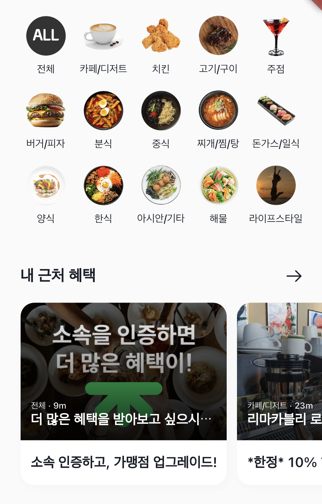
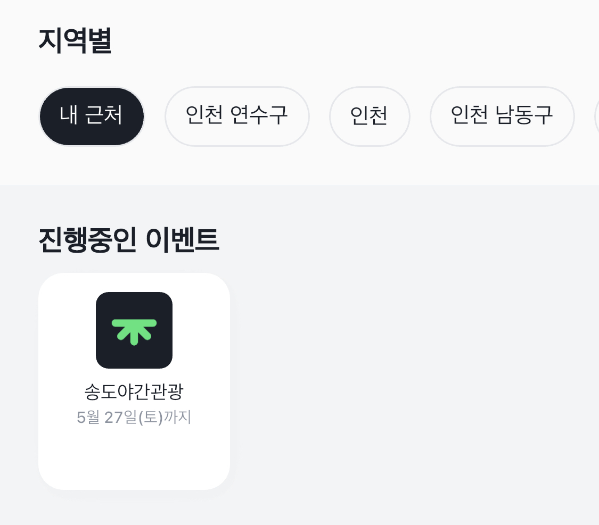
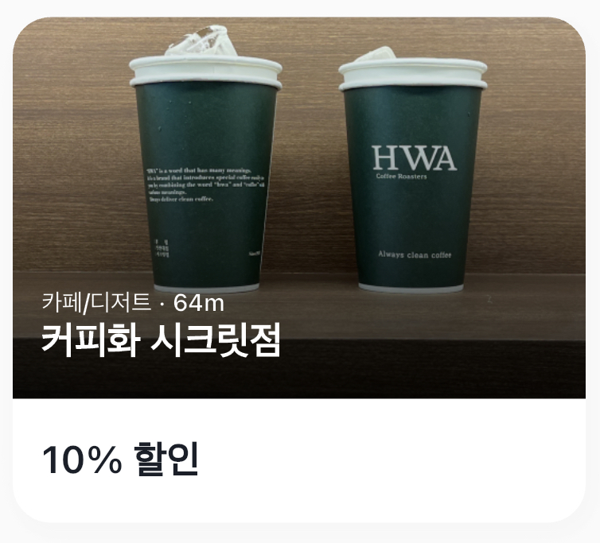
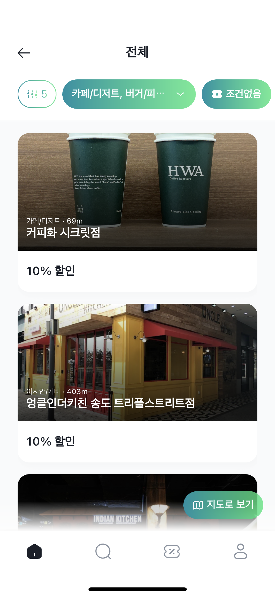
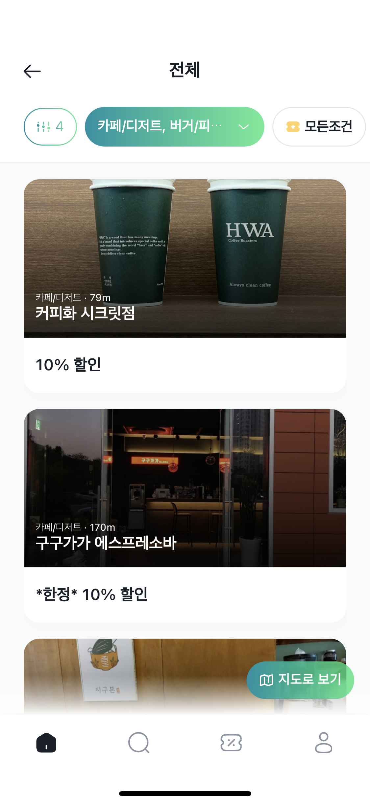
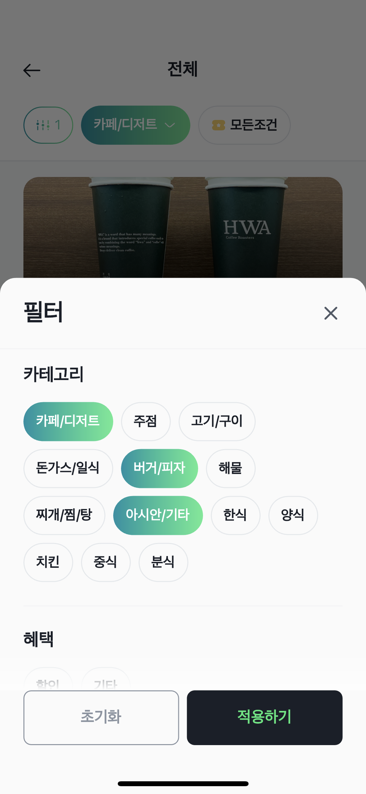
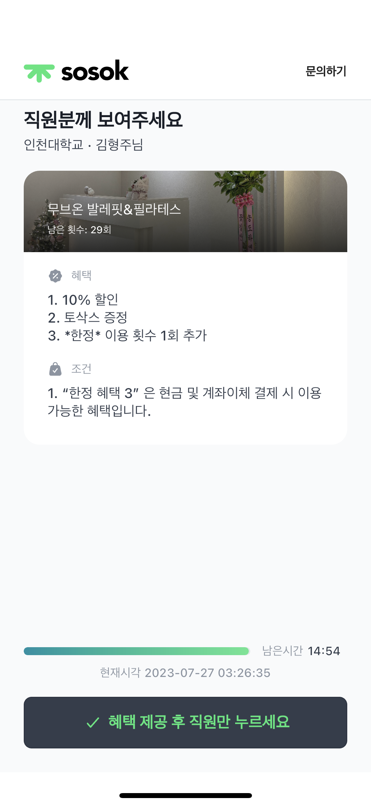
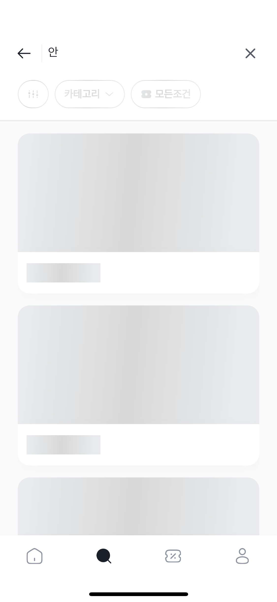

- 5월 3주차
    - 초대장 온보딩 애니메이션 적용
        
        [RPReplay_Final1690423879.mov](images/RPReplay_Final1690423879.mov)
        
    
- 5월 4주차
    - 코드 생성기 구현
        - 변경 전
        
        ```dart
        Assets.lib.icons.bold.money.sale.icon(
          color: baseColor,
          width: 16,
          height: 16,
        );
        
        extension SvgIconAssetsExt on SvgGenImage {
          SvgPicture icon({
            Color? color,
            double width = 24,
            double height = 24,
          }) =>
              this.svg(
                colorFilter:
                    color != null ? ColorFilter.mode(color, BlendMode.srcIn) : null,
                width: width,
                height: height,
                package: 'flutter_sosok_component',
              );
        }
        ```
        
        - 변경 후
            
            ```dart
            // 변경 후
            Assets.icons.close.outline(size: 16);
            Assets.icons.close.bold();
            Assets.images.greenEmptyBox();
            ```
            
            - 직관적인 코드
            - 커스터마이징 가능
            - 재사용성, 유지보수 고려

- 6월 1주차
    - 홈 카테고리
    - 내 근처 혜택
        
        
        
        - 카테고리 개수에 따라 그리드 뷰 적용
        - 화면 크기에 따라 자동 패딩 적용
        
    - 이벤트
        
        
        
    - 카드별 컴포넌트화
        
        
        
        
        
        
        
        
    
    - 변경 전
        
        ```dart
        _StoreItemByDistance(...);
        ```
        
    - 변경 후
        
        ```dart
        SCard.small(...);
        SCard.medium(...);
        SCard.large(...);
        SCard.simple(...);
        ```
        
        - 공통으로 사용되는 코드 통합(Tag, 이미지 형식)
        - 직관적인 코드
        - 재사용성, 유지보수 고려
            
            
- 6월 2주차
    - 필터 모달 적용
        
        
        
        
        
        
        
        
        - 필터 적용한 개수에 따라  개수가 표시되어야한다
        - 필터 적용 여부에 따라 색상이 변경되거나 카테고리의 내용이 추가된다
        - 필터 내용이 없으면 아이템이 비어있는 화면이 나온다
        - 기존 FilterCategory → 동적으로 처리
            - (필터 내용을 추가/수정해야한다면 서버, 앱 동시에 작업을 해야하지만 서버에서만 작업하면 반영되도록 
            적용, 앱 스토어에서 심사해야 되는 과정 생략 및 개발 비용 절감)
            - 서버에서 각 필터마다 선택할 수 있는 최대 개수를 설정해주면 최대 개수만큼 선택되고 더 선택하려 할 시에 처음에 선택된 값이 해제되고 새롭게 선택한 값이 적용되게 개발
        - go_router 검토 및 적용(보류)
            - 페이지 이동 기능 개선
            - 기존 구조 개선
            - 기존 코드에서 오류 발생할 가능성 낮춤

- 6월 3주차
    - 혜택 증명하기
        
        
        [RPReplay_Final1690439100.mov](images/RPReplay_Final1690439100.mov)
        
        
        
        - 애니메이션 적용
        - 혜택과 조건의 단락 높이에 맞춰 카드 높이 맞추기
        - 혜택과 조건의 단락 높이가 카드보다 클 시에 더보기 버튼이 생기고 더보기 버튼 누를 시에 스크롤 가능하도록 구현
        - 혜택, 조건 각각 단락의 높이가 길 시에 1:1로 카드 내부에 차지할 것.
        - 혜택, 조건 중 하나의 단락 높이가 작을 시에 나머지가 카드의 높이만큼 크기를 차지하고 스크롤 가능하도록 구현
        - 로티 적용

- 6월 4주차
    - 로딩 이팩트 적용
        
        
        
        
        
        
        
        
        
        
        
        
        
        
    
    - 로딩중일 때 화면에 미리 그려질 데이터의 위치에 기반하여 로딩화면 적용
    - 이미지 로딩 최적화 및 이미지 로딩 적용

- 6월 5주차
    - Header 컴포넌트화
        
        
        
        
        
        
        
        
        
        
        
        - 변경 전
        
        ```dart
        Header(...);
        ```
        
        - 변경 후
            
            ```dart
            SHeader.title(...);
            SHeader.logo(...);
            SHeader.search(...);
            ```
            
            - 공통으로 사용되는 코드 통합
            - 직관적인 코드
            - 재사용성, 유지보수 고려
        
    - 앱 구조 회의 및 검토
        - clean architecture
    - 이용내역
        
        
        
        
        
        
        - 이용내역 화면 및 로딩
        - 상세조회
        
- 7월 1주차
    - 검색 리뉴얼
        
        [RPReplay_Final1690442907.mov](images/RPReplay_Final1690442907.mov)
        
        - 애니메이션 적용
        - 기존 홈화면과 같이 사용하던 컴포넌트 분리
        - 각 케이스별 구현
            - 검색 홈에서 아무것도 타이핑 안한 상태일 때
            - 검색 홈에서 검색한 기록이 있을 때
            - 검색 홈에서 검색할 때
            - 검색 홈에서 내용이 없을 때
            - 검색 상세에서 아무것도 검색 안했을시
            - 검색 상세에서 검색할 때
            - 검색 상세에서 필터 적용했을 때
            - 검색 상세에서 필터 적용했지만 아이템이 없을 때
            - 검색 상세에서 일치하는 키워드가 없을 때
            - 검색 상세에서 검색 내용이 없을 때
            - 검색 인풋을 눌렀을 때
        - 검색 상세에서 뒤로가기 버튼을 검색결과창 내리는 버튼으로 구현
        - 전체 검색 기록 지우기 기능
        - 현재 검색중인 키워드 지우기 및 포커스 기능
        
    - 파트너스
        
        
        
        - 배너
        - 총 아이템 개수
        - 새로고침
        - 반응형 아이템 크기
    - 앱 구조 개선
        - Data 영역
            - 변경 전
            
            ```dart
            Future<Result<String>> doLogin(LoginUserDto dto) => _handleResult(
              func: _apiService.postLogin({
                'memberEmail': dto.email,
                'memberPassword': dto.password,
              }),
              result: (Map<String, String> data) {
                var result = data['token'];
                if (result == null) {
                  throw AppError(type: AppErrorType.isEmpty, error: AppError.isEmpty);
                }
                return result;
              },
            );
            ```
            
            - 변경 후
            
            ```dart
            @POST('/login')
            Future<HttpResponse<Map<String, String>>> postLogin(
              @Body() Map<String, String> body,
            );
            ```
            
            - data_source_impl 제거
            - Data 영역에서 에러 판별 여부 → Domain 영역에서
            - json을 받아올 때 Model로 파싱
            - Data 영역에서는 데이터 운반
            
             
            
        - Domain 영역
            - 변경 전
            
            ```dart
            Future<Result<String>> doLogin(LoginUserDto dto) async {
              var res = await _remoteDataSource.doLogin(dto);
              if (res.succeeded) {
                await _sessionDataSource.setUserToken(res.data!);
                Result<String> token = await _sessionDataSource.getUserToken();
            
                if (dto.fcmToken?.isNotEmpty == true) {
                  await _remoteDataSource.registerFCMToken(token.data!, dto.fcmToken!);
                }
                return token;
              } else {
                return res;
              }
            }
            ```
            
            - 변경 후
            
            ```dart
            Future<Result<TokenEntity>> requestLogin(LoginDto loginDto) =>
                Result.remoteWrap<TokenEntity>(
                    _apiService.requestLogin(loginDto.toMap()));
            ```
            
            - 에러처리 및 데이터 통신 성공 후 Result로 wrapping 해줌
            - Model(서버) → Entity(앱)로 파싱
            - Domain 영역에서는 데이터 변환
            
        - Presentation 영역
            - 변경 전
            
            ```dart
            Future<Result<UserProfile>> call({LoginUserDto? params}) async {
              if (params == null) {
                throw AppError(error: AppError.paramIsNull, type: AppErrorType.required);
              }
              var res = await _accountRepo.doLogin(params);
              if (res.succeeded) {
                return _accountRepo.getUserProfile(true);
              } else {
                return ResultError(res.error!);
              }
            }
            ```
            
            - 변경 후
            
            ```dart
            Future<void> call({
              required LoginDto params,
              required ResultLoadingCallback onLoading,
              required ResultSuccessCallback<void> onSuccess,
              required ResultErrorCallback onError,
            }) async {
              onLoading();
              await _sessionRepository
                  .requestLogin(params)
                  .next<void>((data) => _sessionRepository.setUserToken(data))
                  .done<void>(onSuccess, onError);
            }
            ```
            
            - 기존에 repository에서 전부 처리하던 것을 usecase로 처리하도록 변경
            - bloc에서 state처리하기 쉽도록 변경
            - Usecase에선 repository를 조합하여 로직 작성
        - Api 병렬 호출
            - 변경 전
            
            ```dart
              await _storeRepo.getDetailItems(params); // 2s
              await _storeRepo.getDetailFilters(params); // 1s
            ```
            
            - 변경 후
            
            ```dart
            Future.wait([
              _storeRepo.getDetailItems(params), // 2s
              _storeRepo.getDetailFilters(params), // 1s
            ])
            ```
            
            - 변경 전 코드는 첫번째 코드가 완료되면 다음코드를 실행해 3초가 걸리지만
            변경 후 코드는 동시에 실행해 기다릴 필요가 없어 2초만 걸림

- 7월 2주차
    - 앱 에러처리 방안 회의
    - interceptor 처리 방안 및 적용
        - 변경 전
            
            ```dart
            @override
            Future<Result<UserAuthSession>> getResentGroupAuth(bool forceUpdate) async {
              final String token = await _getUserToken();
            	...
            }
            
            @override
            Future<Result<UserAuthSession>> updateGroupAuthSession() async {
              final String token = await _getUserToken();
            	...
            }
            
            @override
            Future<Result<bool>> registerFCMToken(String fcmToken) async {
              final String token = await _getUserToken();
            	...
            }
            
            ...
            ```
            
        - 변경 후
            
            ```dart
            void onRequest(
                RequestOptions options, RequestInterceptorHandler handler) async {
                await _sessionRepository.getUserToken().done<TokenEntity?>((data) {
            }
            ```
            
            - 기존에 매 요청 때마다 토큰을 조회하는 코드를 작성해주었던것을 모든 요청할 때 토큰을 조회하도록 변경함
    
    - Flutter Secure Storage 적용
        - 유저 정보, 토큰같이 민감한 정보들을 암호화된 DB에 저장
        
        ```dart
        class TokenEntity implements EntityConverter<TokenModel> {
          final String? token;
          TokenEntity({
            required this.token,
          });
        
          @override
          TokenModel toModel() => TokenModel(token: token);
        }
        ```
        
        ```dart
        @JsonSerializable()
        class TokenModel implements ModelConverter {
          final String? token;
          TokenModel({
            required this.token,
          });
        
          factory TokenModel.fromJson(Map<String, dynamic> json) =>
              _$TokenModelFromJson(json);
        
          @override
          Map<String, dynamic> toJson() => _$TokenModelToJson(this);
        
          @override
          TokenEntity toEntity() => TokenEntity(token: token);
        }
        ```
        
        - Entity, Model 각 변환 작업 검증 및 적용
        
- 7월 3주차
    - ObjectBox
        - 다른 DB에 비해 빠름
        - 다른 DB와 달리 모델을 지원
        - test 작업 환경 셋팅
        - test DB환경 적용
        - data, domain, usecase, bloc 적용
        - observable 적용
    
    - 최근 본 혜택
        
        
        
        
        
        
        - 최근 본 순서대로 자동 정렬
        - 50개까지만 보이기
        - 로그아웃 시 기존에 본 혜택 삭제
        - 날짜별로 그룹화해서 보이기
    - 병렬 비동기 처리 Result<Success, Error> 반환작업 정형화

- 7월 4주차
    - 작업 환경이 다를시에 발생하는 이슈 수정
    - 로그인, 회원가입시 발생하는 토큰 이슈 문제 수정
    - 앱 버그 전수조사
    - 앱 테스트 환경 구성 및 스터디
    - test 코드 환경설정 및 구축
    - iOS, AOS Indend에서 결제 앱으로 안나가는 현상 해결

- 8월 1주차
    - 앱 초기 로딩 속도 개선 2s → 1s
    - 마케팅 수신동의자 푸시알림 발송속도 개선
    - iOS 앱 심사 거절 대응
    - 앱 강제 업데이트 적용
    - ios, Android 기기에서 간헐적으로 로딩화면에서 넘어가지 않는 문제